# Guía de Hardware y Esquema de Conexiones - Cyberdeck ESP32-S3

Esta guía detalla los componentes necesarios, dónde comprarlos y cómo realizar las conexiones físicas para construir la placa del Cyberdeck.

---

## 1. Lista de Componentes (Bill of Materials)

| Componente | Especificación Técnica | Propósito en el Cyberdeck |
| :--- | :--- | :--- |
| **Placa de Desarrollo ESP32-S3** | ESP32-S3 DevKitC-1 o módulo ESP32-S3-WROOM-1 (con pines de GPIO libres de 1 a 42). | Cerebro del Cyberdeck, encargado de BLE, WiFi, procesamiento y UI. |
| **Pantalla TFT ST7789** | IPS 2.0" o 2.4", resolución 240x320, interfaz SPI (sin pantalla táctil necesaria). | Interfaz gráfica de usuario y visualización de datos. |
| **Módulos nRF24L01+ (x2)** | Módulo transceptor de 2.4 GHz (con o sin antena externa SMA). | Escaneo pasivo y transmisión en frecuencias de 2.4 GHz. |
| **Módulo Lector MicroSD** | Lector MicroSD por bus SPI (compatible con 3.3V/5V). | Carga de base de datos de GPS y almacenamiento de capturas. |
| **Módulo GPS NEO-6M** | Módulo receptor GPS con antena cerámica, interfaz UART. | Obtención de coordenadas geográficas en tiempo real. |
| **Encoder Rotativo EC11** | Encoder rotativo estándar con botón pulsador central. | Navegación rápida por los menús del sistema. |
| **Pulsadores Táctiles (x4)** | Botones de 6x6 mm o 12x12 mm (Normalmente Abiertos). | Botones físicos directos: UP, DOWN, OK y BACK. |
| **Zumbador Pasivo (Buzzer)** | Zumbador piezoeléctrico de 5V o 3.3V. | Indicador sonoro de clics y alertas del sistema. |
| **Batería y Sistema de Carga** | Batería Li-Po o Li-Ion (ej: 18650 3.7V) + Cargador TP4056 + Elevador de tensión (MT3608) a 5V/3.3V. | Alimentación portátil autónoma. |
| **Resistencias** | 1x 2.2kΩ y 1x 1kΩ (tolerancia 1% recomendada para precisión). | Divisor de tensión para lectura analógica del nivel de batería. |
| **Condensadores Electrolíticos**| 2x 10µF o 47µF (baja ESR). | Filtro de alimentación colocado junto al pin VCC de cada nRF24L01. |

---

## 2. ¿Dónde Comprar los Componentes?

Puedes comprar estos componentes en las siguientes tiendas online:

### AliExpress (Opción más económica y recomendada para proyectos DIY)
*   **ESP32-S3 DevKit**: Busca *"ESP32-S3 Dev Board USB-C 44 pins"*.
*   **Pantalla ST7789**: Busca *"ST7789 IPS 240x320 2.4 inch SPI display"*.
*   **nRF24L01+**: Busca *"nRF24L01 mini module 2.4G"* (los de formato miniatura son excelentes para PCBs pequeñas).
*   **GPS NEO-6M**: Busca *"NEO-6M GPS Module Arduino UART"*.
*   **Lector SD**: Busca *"Micro SD card adapter module SPI"*.
*   **Encoder EC11**: Busca *"EC11 rotary encoder module"*.

### Amazon (Envío rápido)
*   Disponibles en packs de varias unidades (por ejemplo, packs de botones, resistencias, zumbadores y cables de prototipo), ideales para tener stock de repuestos.

---

## 3. Diagrama de Conexiones (Esquema de Pines)

El siguiente diagrama muestra cómo interconectar cada componente a la placa central ESP32-S3:

```mermaid
graph TD
    subgraph ESP32S3 ["ESP32-S3 DEV BOARD"]
        GND[GND]
        V33[3.3V]
        V5[5V]
        
        %% SPI 1
        SCK_1[GPIO 12]
        MOSI_1[GPIO 11]
        MISO_1[GPIO 13]
        
        %% SPI 2 (SD)
        SCK_2[GPIO 36]
        MOSI_2[GPIO 35]
        MISO_2[GPIO 37]
        
        %% CS/Control Pins
        TFT_CS[GPIO 10]
        TFT_DC[GPIO 21]
        TFT_RST[GPIO 14]
        
        NRF1_CE[GPIO 4]
        NRF1_CS[GPIO 5]
        NRF2_CE[GPIO 6]
        NRF2_CS[GPIO 7]
        
        SD_CS[GPIO 16]
        
        %% UART GPS
        GPS_RX_PIN[GPIO 18]
        GPS_TX_PIN[GPIO 17]
        
        %% Buttons
        BTN_UP[GPIO 1]
        BTN_DOWN[GPIO 2]
        BTN_OK[GPIO 42]
        BTN_BACK[GPIO 41]
        
        %% Encoder
        ENC_CLK[GPIO 40]
        ENC_DT[GPIO 39]
        ENC_SW[GPIO 38]
        
        %% Buzzer & Batt
        BUZZER_PIN[GPIO 15]
        BAT_ADC[GPIO 9]
    end

    subgraph TFT ["Pantalla ST7789"]
        T_VCC[VCC] --> V33
        T_GND[GND] --> GND
        T_SCL[SCL/SCK] --> SCK_1
        T_SDA[SDA/MOSI] --> MOSI_1
        T_CS[CS] --> TFT_CS
        T_DC[DC] --> TFT_DC
        T_RST[RST] --> TFT_RST
    end

    subgraph NRF1 ["Radio nRF24 #1"]
        N1_VCC[VCC] --> V33
        N1_GND[GND] --> GND
        N1_SCK[SCK] --> SCK_1
        N1_MOSI[MOSI] --> MOSI_1
        N1_MISO[MISO] --> MISO_1
        N1_CE[CE] --> NRF1_CE
        N1_CSN[CSN] --> NRF1_CS
    end

    subgraph NRF2 ["Radio nRF24 #2"]
        N2_VCC[VCC] --> V33
        N2_GND[GND] --> GND
        N2_SCK[SCK] --> SCK_1
        N2_MOSI[MOSI] --> MOSI_1
        N2_MISO[MISO] --> MISO_1
        N2_CE[CE] --> NRF2_CE
        N2_CSN[CSN] --> NRF2_CS
    end

    subgraph SD ["Lector MicroSD"]
        SD_VCC[VCC] --> V5
        SD_GND[GND] --> GND
        SD_SCK[SCK] --> SCK_2
        SD_MOSI[MOSI] --> MOSI_2
        SD_MISO[MISO] --> MISO_2
        SD_CS_P[CS] --> SD_CS
    end

    subgraph GPS ["GPS NEO-6M"]
        G_VCC[VCC] --> V5
        G_GND[GND] --> GND
        G_TX[TX] --> GPS_RX_PIN
        G_RX[RX] --> GPS_TX_PIN
    end

    subgraph ENC ["Encoder Rotativo"]
        E_CLK[CLK] --> ENC_CLK
        E_DT[DT] --> ENC_DT
        E_SW[SW] --> ENC_SW
        E_GND[GND] --> GND
    end

    subgraph BTNS ["Pulsadores"]
        B_UP[UP] --> BTN_UP
        B_DN[DOWN] --> BTN_DOWN
        B_OK[OK] --> BTN_OK
        B_BK[BACK] --> BTN_BACK
        B_GND[Common GND] --> GND
    end

    subgraph BATT ["Medidor Bateria"]
        BAT_POS[Bateria +] -->|Res 2.2k| DIV_NODE[Nodo ADC]
        DIV_NODE --> BAT_ADC
        DIV_NODE -->|Res 1.0k| GND
    end
    
    subgraph AUDIO ["Zumbador"]
        BUZ_POS[+] --> BUZZER_PIN
        BUZ_NEG[-] --> GND
    end
```

---

## 4. Notas Clave para el Diseño de tu Placa (PCB o Perfboard)

1.  **Filtro nRF24L01+ (MUY IMPORTANTE)**: Los módulos de radio nRF24 son extremadamente sensibles al ruido eléctrico en la alimentación. **Debes soldar un condensador electrolítico de 10µF (o mayor)** lo más cerca posible de los pines `VCC` y `GND` de cada módulo de radio. Sin este filtro, la comunicación por radio fallará intermitentemente.
2.  **Línea de 3.3V Dedicada**: El regulador interno de un ESP32-S3 a veces no tiene la capacidad de corriente suficiente para alimentar la pantalla TFT (luz de fondo) y ambos transceptores nRF24 simultáneamente. Se recomienda usar un regulador LDO externo de 3.3V (ej: **AMS1117-3.3**) conectado a la línea de 5V para alimentar las radios y la pantalla de forma independiente.
3.  **Compartición de SPI sin Conflictos**: La pantalla TFT ST7789 y los módulos nRF24 comparten la línea `SCK` (GPIO 12) y `MOSI` (GPIO 11). Asegúrate de que las pistas en la placa sean lo más cortas posibles para evitar inductancias y capacitancias parásitas que degraden las señales del bus de alta velocidad.

---

## 5. Diseño Sugerido de la PCB (Vista Frontal y Trasera)

Para optimizar el tamaño físico del Cyberdeck y evitar interferencias electromagnéticas, te sugerimos una disposición de dos capas (Top y Bottom):

### Reglas de Ruteado en tu Software de PCB (KiCad, EasyEDA, etc.):
*   **Zona Despejada para las Antenas**: No coloques planos de cobre ni pistas de señal directamente debajo de la antena impresa en el PCB de los módulos nRF24L01+ ni de la antena cerámica del GPS. Deja esa sección libre en ambas capas.
*   **Pistas de Alimentación Anchas**: Diseña las líneas de alimentación principal de 3.3V y 5V con un grosor mínimo de **24 mil (0.6 mm)** o superior, y las pistas de señal con **10 mil (0.25 mm)**.
*   **Planos de Masa (GND Zones)**: Utiliza un "Copper Pour" (relleno de cobre) conectado a GND en ambas capas. Esto proporciona un excelente retorno de corriente de baja impedancia y apantalla el ruido digital de los buses SPI y UART.
*   **Posición de los Condensadores**: Coloca los condensadores de desacoplo cerámicos de 0.1µF y los electrolíticos de 10µF directamente en los pads de alimentación del ESP32-S3 y de los nRF24L01 antes de que la pista continúe hacia la fuente.
