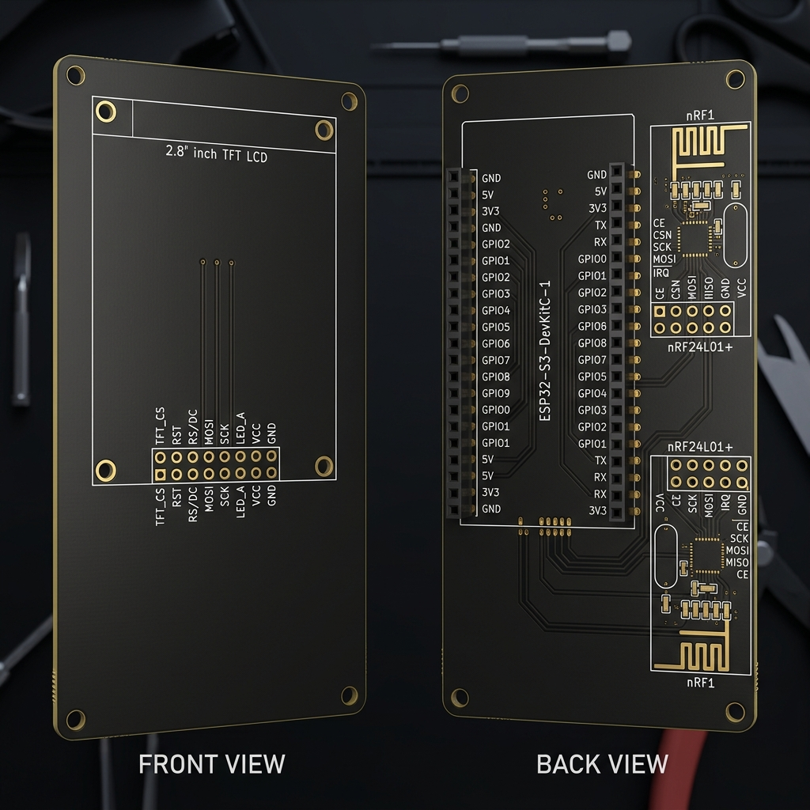

# Guía de Hardware - Cyberdeck ESP32-S3 (Diseño desde Cero)

Esta guía documentará el diseño y ensamblaje de la base (motherboard) del Cyberdeck paso a paso. Comenzamos con una placa base vacía (PCB) y añadiremos cada componente uno a uno.

## La Placa Base Vacía (PCB V2)

Para alojar los componentes en un formato angosto y compacto, utilizaremos una placa de doble cara simplificada:

### Distribución de la Placa Vacía V2:
*   **Cara Frontal (Top Layer):**
    *   **Área de Pantalla (TFT_LCD):** Zócalo/footprint de pines para una pantalla TFT de 2.8" (TFT_CS, RST, RS/DC, MOSI, SCK, LED_A, VCC, GND). *Nota: No hay botones ni encoder rotativo en esta placa.*
*   **Cara Trasera (Bottom Layer):**
    *   **Zócalo ESP32-S3 DevKitC-1 (Centro):** Dos filas de pines hembra para el microcontrolador central.
    *   **Zócalos nRF24L01+ (Lado Derecho):** Footprints y conectores para dos módulos transceptores de radio apilados de forma vertical (nRF24L01+ #1 arriba y #2 abajo). *Nota: No hay socket de tarjeta MicroSD en la parte trasera.*

---

## Componentes y Conexiones (Añadir uno por uno)

Actualmente la placa está vacía. Vamos a ir añadiendo y conectando los componentes de forma ordenada.

> [!IMPORTANT]
> Esperando instrucciones para colocar el primer componente. ¿Cuál componente colocamos primero? (Por ejemplo: el ESP32-S3 central, la pantalla TFT de 2.8", el lector MicroSD, los nRF24L01, etc.)
