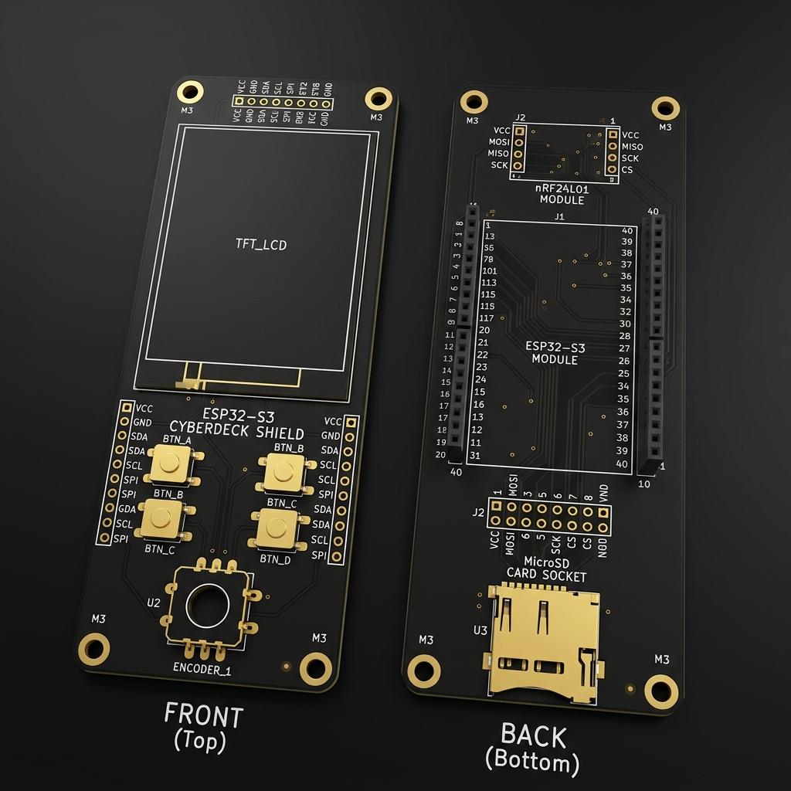

# Guía de Hardware - Cyberdeck ESP32-S3 (Diseño desde Cero)

Esta guía documentará el diseño y ensamblaje de la base (motherboard) del Cyberdeck paso a paso. Comenzamos con una placa base vacía (PCB) y añadiremos cada componente uno a uno.

## La Placa Base Vacía (PCB)

Para alojar los componentes en un formato angosto y compacto, utilizaremos una placa de doble cara:

### Distribución de la Placa Vacía:
*   **Cara Frontal (Top Layer):**
    *   **Área de Pantalla (TFT_LCD):** Espacio en la mitad superior para una pantalla TFT de 2.8".
    *   **Botones (BTN_A, BTN_B, BTN_C, BTN_D):** Cuatro footprints para pulsadores táctiles.
    *   **Codificador (ENCODER_1):** Footprint para un encoder rotativo EC11.
*   **Cara Trasera (Bottom Layer):**
    *   **Zócalo ESP32-S3 (Centro):** Dos tiras de pines hembra para el módulo de desarrollo central.
    *   **Zócalo MicroSD (Abajo):** Footprint para un conector de tarjeta MicroSD.
    *   **Zócalo nRF24L01 (Lado Derecho):** Footprints para los módulos transceptores de radio.

---

## Componentes y Conexiones (Añadir uno por uno)

Actualmente la placa está vacía. Vamos a ir añadiendo y conectando los componentes de forma ordenada.

> [!IMPORTANT]
> Esperando instrucciones para colocar el primer componente. ¿Cuál componente colocamos primero? (Por ejemplo: el ESP32-S3 central, la pantalla TFT de 2.8", el lector MicroSD, los nRF24L01, etc.)
