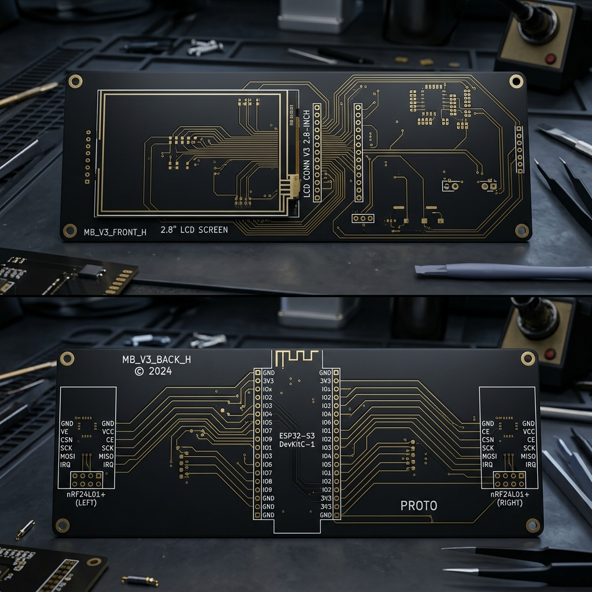
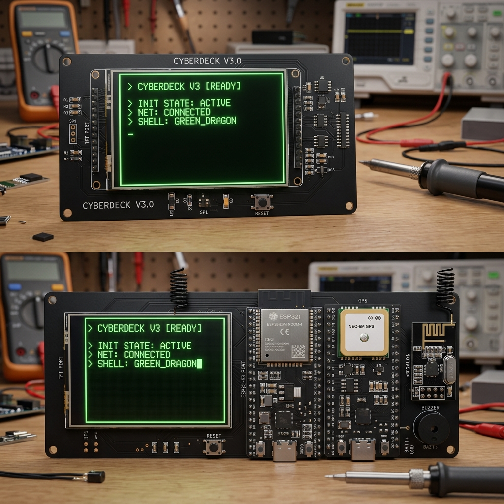

# Guía de Hardware - Cyberdeck ESP32-S3 (Diseño desde Cero)

Esta guía documentará el diseño y ensamblaje de la base (motherboard) del Cyberdeck paso a paso. Comenzamos con una placa base vacía (PCB) y añadiremos cada componente uno a uno.

## Concepto de Diseño: Placa Portadora Pasiva (Shield)

Esta placa base está diseñada bajo un concepto de **placa portadora pasiva (shield)**:
1. **Sin Componentes Integrados:** La PCB no cuenta con circuitos integrados, microchips ni componentes activos montados de fábrica. Consiste puramente en pistas de cobre, zócalos de pines (headers) y pads de soldadura.
2. **Modularidad Total:** Todos los componentes activos y periféricos (el ESP32-S3 DevKit, la Pantalla TFT, los módulos de radio nRF24L01+, el GPS y el Buzzer) son **módulos independientes y externos** que se adquieren por separado y se sueldan o insertan en los zócalos correspondientes de la placa base vacía.
3. **Facilidad de Ensamblaje y Reemplazo:** Si algún módulo falla, puede ser desoldado o retirado de su zócalo sin comprometer el resto de la placa base.

---

## La Placa Base Vacía (PCB V3)

Para alojar los componentes en un formato horizontal (paisaje) amplio y cómodo, utilizaremos una placa de doble cara simplificada:

### Distribución de la Placa Vacía V3:
*   **Cara Frontal (Top Layer):**
    *   **Área de Pantalla (TFT_LCD):** Zócalo/footprint de pines para una pantalla TFT de 2.8" orientada de forma **horizontal** (TFT_CS, RST, RS/DC, MOSI, SCK, LED_A, VCC, GND). *Nota: No hay botones ni encoder rotativo en esta placa.*
*   **Cara Trasera (Bottom Layer):**
    *   **Zócalo ESP32-S3 DevKitC-1 (Centro):** Dos filas de pines hembra para el microcontrolador central en medio de la placa.
    *   **Zócalo nRF24L01+ #1 (Lado Izquierdo):** Footprint y conectores para un transceptor de radio nRF24L01+ ubicado a la **izquierda** de la placa.
    *   **Zócalo nRF24L01+ #2 (Lado Derecho):** Footprint y conectores para el segundo transceptor de radio nRF24L01+ ubicado a la **derecha** de la placa.
    *   *Nota: No hay socket de tarjeta MicroSD en la parte trasera.*

## El Cyberdeck Ensamblado (PCB V3)

Una vez soldados todos los componentes a la placa base, el Cyberdeck tiene la siguiente apariencia (Frente y Reverso):

---

## Tabla de Conexiones Completa

A continuación se detalla el mapeo pin-a-pin entre el **ESP32-S3 DevKitC-1** y los periféricos de la placa. La interfaz SPI principal (SCK, MOSI, MISO) se comparte de forma eficiente entre la pantalla TFT y los dos transceptores nRF24L01+.

| Periférico | Pin Periférico | Pin ESP32-S3 (GPIO) | Descripción / Notas |
| :--- | :--- | :--- | :--- |
| **TFT ST7789 (2.8" SPI)** | SCK | **GPIO 12** | Reloj SPI compartido |
| | MOSI | **GPIO 11** | Salida de Datos SPI compartida (SDA/MOSI) |
| | MISO | **GPIO 13** | Entrada de Datos SPI compartida (MISO) |
| | CS | **GPIO 10** | Chip Select dedicado para TFT |
| | DC / RS | **GPIO 21** | Selección de Registro (Data/Command) |
| | RST | **GPIO 14** | Reset físico de la pantalla |
| | VCC | 3.3V | Alimentación de 3.3V |
| | GND | GND | Tierra común |
| **nRF24L01+ #1 (Izquierdo)** | SCK | **GPIO 12** | Reloj SPI compartido |
| | MOSI | **GPIO 11** | Salida de Datos SPI compartida |
| | MISO | **GPIO 13** | Entrada de Datos SPI compartida |
| | CE | **GPIO 4** | Chip Enable dedicado (nRF1 Izq) |
| | CSN | **GPIO 5** | Chip Select Not dedicado (nRF1 Izq) |
| | VCC | 3.3V | Alimentación exclusiva de 3.3V |
| | GND | GND | Tierra común |
| **nRF24L01+ #2 (Derecho)** | SCK | **GPIO 12** | Reloj SPI compartido |
| | MOSI | **GPIO 11** | Salida de Datos SPI compartida |
| | MISO | **GPIO 13** | Entrada de Datos SPI compartida |
| | CE | **GPIO 6** | Chip Enable dedicado (nRF2 Der) |
| | CSN | **GPIO 7** | Chip Select Not dedicado (nRF2 Der) |
| | VCC | 3.3V | Alimentación exclusiva de 3.3V |
| | GND | GND | Tierra común |
| **GPS NEO-6M** | TX | **GPIO 18** | Transmisión del GPS -> Recepción ESP32 |
| | RX | **GPIO 17** | Recepción del GPS <- Transmisión ESP32 |
| | VCC | 3.3V / 5V | Alimentación de energía |
| | GND | GND | Tierra común |
| **Buzzer Activo/Pasivo** | Signal | **GPIO 15** | Control PWM / Tono del zumbador |
| | GND | GND | Tierra común |
| **Batería (ADC VBAT)** | VBAT (Sensado) | **GPIO 9** | Conexión al divisor resistivo (2.2kΩ / 1kΩ) |

> [!IMPORTANT]
> **Componentes Excluidos en V3:**
> Siguiendo las instrucciones de diseño de la placa, se han omitido los siguientes pines y componentes en el ruteo:
> - **Lector MicroSD** (originalmente en GPIOs 36/35/37/16) - *Removido físicamente del reverso.*
> - **Botones Físicos** (originalmente en GPIOs 1/2/42/41) - *Removidos físicamente del frente.*
> - **Encoder Rotativo** (originalmente en GPIOs 40/39/38) - *Removido físicamente del frente.*

---

## Esquema de Conexiones (Diagrama)

El siguiente diagrama muestra cómo interactúan las líneas de control y datos en el bus SPI compartido y en los periféricos dedicados:

```mermaid
graph TD
    subgraph ESP32-S3 DevKitC-1
        G9[GPIO 9 / VBAT]
        G10[GPIO 10 / CS TFT]
        G11[GPIO 11 / MOSI]
        G12[GPIO 12 / SCK]
        G13[GPIO 13 / MISO]
        G14[GPIO 14 / RST TFT]
        G15[GPIO 15 / Buzzer]
        G17[GPIO 17 / TX GPS]
        G18[GPIO 18 / RX GPS]
        G21[GPIO 21 / DC TFT]
        G4[GPIO 4 / CE nRF1 Izq]
        G5[GPIO 5 / CSN nRF1 Izq]
        G6[GPIO 6 / CE nRF2 Der]
        G7[GPIO 7 / CSN nRF2 Der]
    end

    subgraph TFT ST7789 2.8
        TFT_SCK[SCK]
        TFT_MOSI[MOSI]
        TFT_CS[CS]
        TFT_DC[DC]
        TFT_RST[RST]
    end

    subgraph nRF24L01 1["nRF24L01+ #1 (Izquierdo)"]
        RF1_SCK[SCK]
        RF1_MOSI[MOSI]
        RF1_MISO[MISO]
        RF1_CE[CE]
        RF1_CSN[CSN]
    end

    subgraph nRF24L01 2["nRF24L01+ #2 (Derecho)"]
        RF2_SCK[SCK]
        RF2_MOSI[MOSI]
        RF2_MISO[MISO]
        RF2_CE[CE]
        RF2_CSN[CSN]
    end

    subgraph GPS NEO-6M
        GPS_TX[TX]
        GPS_RX[RX]
    end

    subgraph Zumbador
        BZ_SIG[Signal]
    end

    subgraph Divisor de Voltaje
        R_DIV[Punto Medio 2.2k/1k]
    end

    %% Bus SPI Compartido
    G12 --> TFT_SCK
    G12 --> RF1_SCK
    G12 --> RF2_SCK

    G11 --> TFT_MOSI
    G11 --> RF1_MOSI
    G11 --> RF2_MOSI

    G13 --> RF1_MISO
    G13 --> RF2_MISO

    %% Controles Dedicados TFT
    G10 --> TFT_CS
    G21 --> TFT_DC
    G14 --> TFT_RST

    %% Controles Dedicados nRF24 #1
    G4 --> RF1_CE
    G5 --> RF1_CSN

    %% Controles Dedicados nRF24 #2
    G6 --> RF2_CE
    G7 --> RF2_CSN

    %% UART GPS
    G18 --> GPS_TX
    G17 --> GPS_RX

    %% Buzzer
    G15 --> BZ_SIG

    %% Monitoreo VBAT
    R_DIV --> G9
```

---

## Guía de Ruteo y Diseño Físico de la PCB

1. **Alimentación y Filtrado de Ruido (Crítico para nRF24L01+):**
   - Los módulos nRF24L01+ consumen picos de corriente elevados al transmitir. Se debe colocar un condensador electrolítico de **10µF o superior** en paralelo con un condensador cerámico de **0.1µF (100nF)** lo más cerca posible de los pines VCC y GND de cada zócalo nRF24L01+.
   - Alimentar los nRF24L01+ **únicamente con 3.3V**. Aplicar 5V dañará permanentemente los módulos.

2. **Divisor Resistivo de Batería (VBAT):**
   - El divisor de tensión debe colocarse físicamente cerca del pin GPIO 9 del ESP32-S3 para minimizar el acoplamiento de ruido electromagnético de alta frecuencia en la línea analógica.
   - El pin de sensado se conecta al punto medio entre la resistencia de **2.2kΩ** (conectada al positivo de la batería) y la resistencia de **1kΩ** (conectada a GND). 
   - Se recomienda soldar un condensador pequeño de **0.1µF** en paralelo con la resistencia de 1kΩ para estabilizar las lecturas del ADC.

3. **Líneas de Alta Velocidad (SPI):**
   - Las pistas del bus SPI (GPIO 12, 11, 13) deben tener longitudes similares y evitar ruteos cercanos a la antena del ESP32-S3 o a las líneas de transmisión RF de los nRF24L01+.
   - Utilizar planos de tierra continuos en ambas capas (Top y Bottom) para reducir interferencias electromagnéticas (EMI).
